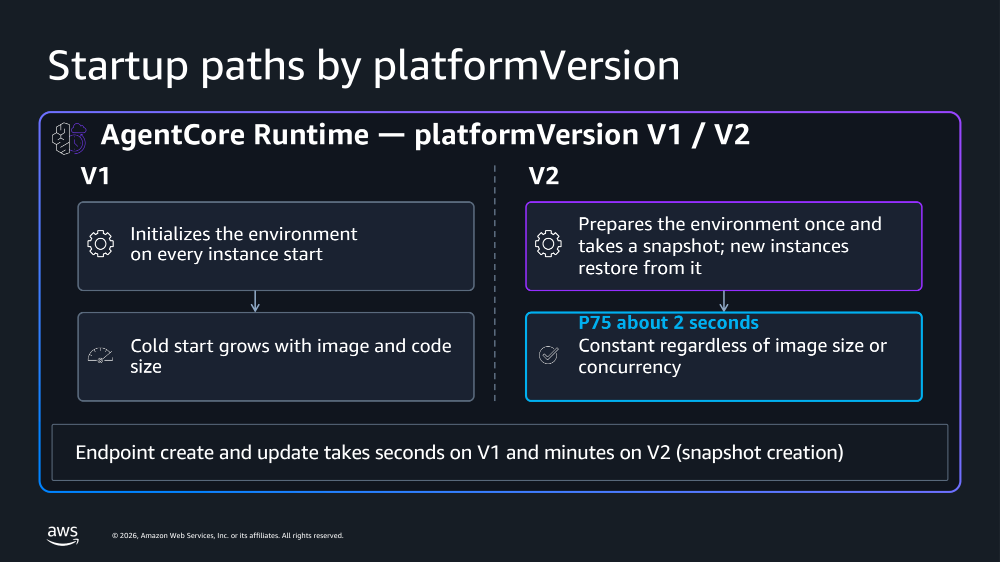
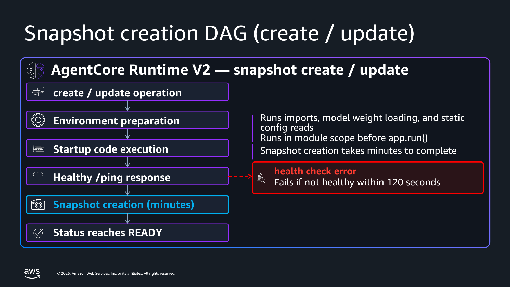
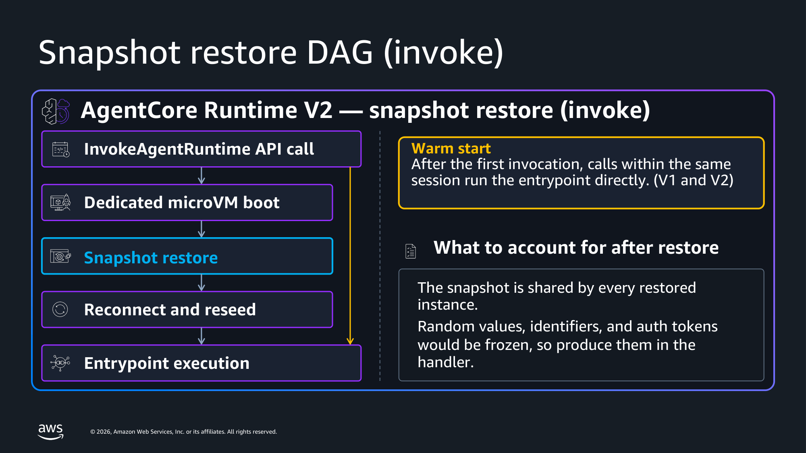

English | [Japanese](README_JA.md)

# Amazon Bedrock AgentCore Runtime V2: platformVersion Samples

> [!NOTE]
> This repository is not provided by AWS. It is a sample based on verification in one personal environment. My opinions are my own.

Sample code for trying out platform version V2 of Amazon Bedrock AgentCore Runtime. V2 starts your agent by restoring a snapshot of the environment, so cold starts stay consistent regardless of image size or concurrency. You enable it per agent runtime by setting `platformVersion` to `V2`; the default is `V1`.

Use the scripts in this repository to create a V2 runtime, migrate an existing V1 runtime to V2, confirm the platform version, invoke the runtime, and measure cold start.

Blog post (Japanese): https://zenn.dev/aws_japan/articles/agentcore-runtime-v2-platform-version



Deployment modes are abbreviated as follows.

- CodeZip: direct code deployment. You put a ZIP in S3 and it runs in the Python environment that AgentCore manages.
- Container: container deployment. You put an ARM64 image in ECR.

You specify `platformVersion` the same way for both modes. Only the artifact differs.

## Structure

```
.
├── agent-basic/                 Minimal Strands agent. Prints module-scope and handler markers.
├── agent-bench/                 Benchmark target. Strands + Bedrock, streaming, timing markers.
│                                Each agent dir holds main.py, Dockerfile and requirements.txt.
│                                The Dockerfile and the ZIP builder read the same requirements.txt.
├── scripts/
│   ├── common.py                Shared config and helpers. Reads all settings from env vars.
│   ├── check_sdk_version.py     Verify the installed SDK supports platformVersion. No AWS calls.
│   ├── setup_prerequisites.py   Create the execution role, ECR repository and S3 bucket.
│   ├── setup_codezip_artifact.py Build an ARM64 ZIP and upload it to S3 (no Docker needed).
│   ├── create_runtime.py        Create a runtime with V1 / V2 / omitted, timing READY.
│   ├── switch_platform_version.py Move an existing runtime between V1 and V2.
│   ├── get_runtime.py           Read platformVersion via get_agent_runtime.
│   ├── invoke_runtime.py        Invoke with fresh sessions and compare against session reuse.
│   └── cleanup.py               Delete matching runtimes and the prerequisite resources.
├── benchmark/
│   ├── apply_config.py          Apply artifact / env / platformVersion in one update, timing READY.
│   ├── tps_bench_open.py        Open-loop load generator. Reports the TPS it actually achieved.
│   ├── build_breakdown.py       Join client records with [ENTRYPOINT_REACHED] from CloudWatch Logs.
│   ├── plot_preentry.py         Render the pre-entrypoint distribution chart.
│   └── requirements.txt         matplotlib / numpy / scipy
├── images/
│   ├── ja/                      Japanese figures
│   ├── en/                      English figures
│   └── commons/                 Language-independent figures
├── requirements.txt             boto3>=1.43.95
├── build/                       Working directory for the ZIP builder (gitignored)
└── results/                     JSON output from every script (gitignored)
```

## Prerequisites

- Python 3.10 or later.
- `boto3>=1.43.95`. This is the first public release that carries the `platformVersion` field. Earlier versions reject the request with `ParamValidationError` before it is sent.
- An AgentCore Runtime execution role, an ECR repository (for Container) and an S3 bucket (for CodeZip). `scripts/setup_prerequisites.py` creates all three.
- A Region where V2 is available. For the current list, see [microVMs — Supported Regions](https://docs.aws.amazon.com/bedrock-agentcore/latest/devguide/runtime-how-it-works.html#runtime-platform-versions-regions).
- For Container: Docker with `docker buildx`. AgentCore Runtime microVMs run ARM64 Linux.

> [!NOTE]
> AWS CloudFormation and the AWS CDK do not currently support setting `platformVersion`. Use the AWS SDK, the AWS CLI, or the console.

## Setup

```bash
git clone https://github.com/SeongHaedu/amazon-bedrock-agentcore-runtime-v2-samples.git
cd amazon-bedrock-agentcore-runtime-v2-samples

python3 -m venv .venv
source .venv/bin/activate
pip install -r requirements.txt
```

Run every command below from the repository root.

## Step 0: Create the prerequisite resources

```bash
python scripts/setup_prerequisites.py
```

Creates the execution role, the ECR repository and the S3 bucket in `AWS_REGION` (default `us-west-2`), and records them in `results/setup_prerequisites.json`. Every Python script in this repository reads that file, so there is nothing to export for them.

The `docker` commands in Step 2 do need the values in your shell. The script writes them as an env file for that:

```bash
source results/setup_prerequisites.env
```

Set `AWS_REGION` before running the script to place the resources in another Region. For the Regions where V2 is available, see [microVMs — Supported Regions](https://docs.aws.amazon.com/bedrock-agentcore/latest/devguide/runtime-how-it-works.html#runtime-platform-versions-regions). The role is global, so a second Region reuses it; its trust and permission policies are rewritten on every run and carry no Region of their own.

A resource that already exists is reported and left as it is. Everything the script creates carries the `ManagedBy=agentcore-runtime-v2-samples` tag, which makes it a target for `scripts/cleanup.py`. Resources without that tag are never deleted.

The role follows [IAM Permissions for AgentCore Runtime](https://docs.aws.amazon.com/bedrock-agentcore/latest/devguide/runtime-permissions.html). Read access to the S3 bucket holding the ZIP is not included: the service fetches the artifact itself.

### Optional: environment variables

Everything below has a default, and an environment variable always wins over the saved file. Set one only when you want to change it.

```bash
export AWS_REGION=<region>                               # where the resources and runtimes go
export AGENTCORE_ROLE_ARN=<role-arn>                     # use a role you already have
export AGENTCORE_CONTAINER_URI=<uri>:<tag>               # use a repository you already have
export AGENTCORE_S3_BUCKET=<bucket-name>                 # use a bucket you already have
export AWS_PROFILE=<profile>
export AGENTCORE_S3_PREFIX=agentcore/codezip/agent.zip   # S3 key for the ZIP
export AGENTCORE_NAME_PREFIX=v2sample_                   # cleanup.py deletes only this prefix (4 chars minimum)
export AGENTCORE_CODE_RUNTIME=PYTHON_3_11                # runtime for CodeZip
export AGENTCORE_ENTRY_POINT=main.py                     # comma-separated for more than one element
export AGENTCORE_WAIT_TIMEOUT_SEC=1800                   # how long to poll for a terminal status
export BEDROCK_MODEL_ID=jp.anthropic.claude-sonnet-4-6   # passed to the agent under the same name; agent-bench reads it
export AGENTCORE_ENV_EXTRA=KEY=VALUE,KEY2=VALUE2         # any other environment variable the agent should receive
export AGENTCORE_SETUP_ROLE_NAME=<name>                  # role name setup_prerequisites.py creates
export AGENTCORE_SETUP_ECR_REPOSITORY=<name>             # repository name it creates
export AGENTCORE_SETUP_S3_BUCKET=<name>                  # bucket name it creates
```

`entryPoint` is an array. Pass a comma-separated value when you need more than one element, for example `AGENTCORE_ENTRY_POINT="opentelemetry-instrument,main.py"`.

Every runtime is created with `PYTHONUNBUFFERED=1`, and `BEDROCK_MODEL_ID` and `AGENTCORE_ENV_EXTRA` are layered on top of it. `scripts/create_runtime.py` applies them at create time and `benchmark/apply_config.py` applies them to an existing runtime. A value containing a comma cannot be passed through `AGENTCORE_ENV_EXTRA`.

## Step 1: Check the SDK

```bash
python scripts/check_sdk_version.py
```

This makes no AWS calls. It reads the installed botocore service model and reports whether `platformVersion` is present on the `CreateAgentRuntime` and `UpdateAgentRuntime` inputs and the `GetAgentRuntime` output. `platformVersion` is response-only, so its absence from the `GetAgentRuntime` input is expected.

## Step 2: Build an artifact

### Option A: Container

```bash
aws ecr get-login-password --region $AWS_REGION \
  | docker login --username AWS --password-stdin \
    $(echo $AGENTCORE_CONTAINER_URI | cut -d/ -f1)

docker buildx build --platform linux/arm64 \
  -t $AGENTCORE_CONTAINER_URI \
  --push agent-basic/
```

### Option B: CodeZip (no Docker)

```bash
python scripts/setup_codezip_artifact.py agent-basic
```

This vendors dependencies for `manylinux2014_aarch64`, zips them together with `main.py`, and uploads the archive to `s3://$AGENTCORE_S3_BUCKET/$AGENTCORE_S3_PREFIX`.

The upload target is that one prefix. Running the script for a second agent overwrites the archive, and every runtime pointing at the prefix then serves the new agent. Give each agent its own `AGENTCORE_S3_PREFIX` when you want them to coexist. Step 7 builds a ZIP from `agent-bench`.

## Step 3: Create a V2 runtime

The snapshot is taken on create and on update. AgentCore Runtime starts your container, waits for `/ping` to report healthy, and then saves the running environment as a snapshot.



```bash
python scripts/create_runtime.py basic_v2 container V2
```

Replace `container` with `codezip` if you built the ZIP. The third argument is the platform version: `V2`, `V1`, or `omit`.

`omit` is not a value the API accepts. It means the request leaves the `platformVersion` field out entirely. On create the default is V1, so a runtime created with `omit` runs on V1. It still differs from passing `V1` explicitly in the `get_agent_runtime` response: with `omit` the `platformVersion` key is absent, and with an explicit `V1` it is present. Step 4 shows the difference.

On update, `omit` means something else: the default V1 applies on create, while the current platform version is kept on update. Both are documented. Step 5 covers the difference.

A V2 create prepares the environment and takes a snapshot, so it takes minutes rather than seconds. The script polls `get_agent_runtime` until the status is `READY` or ends in `FAILED`, and prints each status transition with its elapsed time.

The same applies to updates. An update to a V2 runtime prepares a snapshot, so ordinary updates such as swapping the artifact also take minutes.

To see the difference for yourself, create a V1 runtime from the same artifact.

```bash
python scripts/create_runtime.py basic_v1 container omit
```

## Step 4: Confirm the platform version

```bash
python scripts/get_runtime.py
```

`platformVersion` appears only in the `get_agent_runtime` response. The `create_agent_runtime`, `update_agent_runtime` and `list_agent_runtimes` responses do not carry it, so this script calls `get_agent_runtime` per runtime.

The output also prints the runtime id and the ARN. Steps 6 and 7 need them, so keep them at hand.

```
[v2sample_basic_v2] status=READY platformVersion='V2' (key present: True) agentRuntimeVersion=1
    id=v2sample_basic_v2-xxxxxxxxxx
    arn=arn:aws:bedrock-agentcore:<region>:<account-id>:runtime/v2sample_basic_v2-xxxxxxxxxx
```

`key present` reports whether the `platformVersion` key was in the response at all. It is `False` for a runtime created with `omit` in step 3. Write your own checks as `resp.get("platformVersion", "V1")`. V1 is the default.

## Step 5 (optional): Migrate V1 to V2

If you created a V2 runtime directly in step 3, skip this step and go to step 6. Read this when you need to move an existing V1 runtime to V2.

```bash
python scripts/switch_platform_version.py <agentRuntimeId> V2
```

`update_agent_runtime` requires `roleArn` and `agentRuntimeArtifact`, so the script reads the current values with `get_agent_runtime` and passes them through. It also carries `environmentVariables` forward explicitly, because the documentation does not state whether omitting them clears the existing values.

Two behaviors are worth seeing directly.

- `V2` to `V1` completes in seconds. No snapshot preparation is needed.
- Omitting `platformVersion` on a runtime that is already V2 keeps it on V2 and still prepares a snapshot.

The second one may look like it contradicts step 3, but it is documented behavior. [microVMs — Platform versions](https://docs.aws.amazon.com/bedrock-agentcore/latest/devguide/runtime-how-it-works.html#runtime-platform-versions) carries both sentences:

> If you omit `platformVersion` when you create a runtime, the runtime uses V1.
>
> If you omit it when you update a runtime, the runtime keeps its current platform version.

Omitting it on create means the default V1; omitting it on update means the current platform version is kept. Going back to V1 requires passing `V1` explicitly.

Note that this is documented for `platformVersion` specifically. Whether other omitted fields keep or lose their existing values is stated neither in the API reference nor on the `UpdateAgentRuntime` page, which is why `environmentVariables` is carried forward explicitly.

```bash
python scripts/switch_platform_version.py <agentRuntimeId> V1     # seconds
python scripts/switch_platform_version.py <agentRuntimeId> omit   # minutes, stays on V2
```

## Step 6: Invoke

A new microVM is restored from the snapshot. The second and later invokes in the same session skip that path and run the entrypoint directly.



```bash
python scripts/invoke_runtime.py <agentRuntimeId|agentRuntimeArn> 3 2
```

The arguments are the number of sessions and the number of invokes per session. Each session uses a fresh `runtimeSessionId`, so every first invoke goes through the startup path. The second invoke in the same session lands on the existing environment, which gives you the floor for a request that includes no startup work.

`agent-basic` returns a `snapshot_identity` object built at module scope. Watch the `distinct identity uuid` line the script prints at the end.

- On V2 it collapses. Three sessions against a Container runtime reported 1: every instance was restored from the same snapshot. A larger burst can report more than 1, so do not treat 1 as a guarantee.
- On V1 it matches the number of new execution environments. Each one ran module scope itself.

### Ask it a question

With `--query`, the question goes through the Strands agent to Bedrock and the answer comes back in the response.

```bash
python scripts/invoke_runtime.py <agentRuntimeId|agentRuntimeArn> 1 1 --query 'What does platformVersion V2 buy me?'
```

Without `--query` no model is called. Leave it out for the `distinct identity uuid` comparison above, so that model-side variance stays out of it.

The Strands agent in `agent-basic` is built at module scope. On V2 that initialization is part of the snapshot; on V1 it is repeated per execution environment. The difference measured in step 7 comes from exactly this shape.

`BEDROCK_MODEL_ID` selects the model. In a Region with no cross-Region inference profile carrying the `us.` prefix, pass a Region-local profile. `scripts/create_runtime.py` forwards it at create time, and `benchmark/apply_config.py` sets it on an existing runtime. Sending `--query` in a Region where it is unset puts the reason in the response as `answer: model call failed`.

### After you change the agent code

Editing `main.py` or `requirements.txt` does not reach a running runtime. Rebuild the artifact and update the existing runtime. Running `scripts/create_runtime.py` with the same name fails with `ConflictException`.

For Container:

```bash
docker buildx build --platform linux/arm64 -t $AGENTCORE_CONTAINER_URI --push agent-basic/
python benchmark/apply_config.py <agentRuntimeId> keep V2 none code_update
```

For CodeZip:

```bash
python scripts/setup_codezip_artifact.py agent-basic
python benchmark/apply_config.py <agentRuntimeId> keep V2 none code_update
```

`apply_config.py` lives under `benchmark/`, but it is a general-purpose script that applies the artifact, the environment variables and `platformVersion` in a single `update_agent_runtime` call. The second argument is the artifact, and `keep` leaves it as it is. Pass the new value when you change the image tag or `AGENTCORE_S3_PREFIX`. The `V2` in the third argument states the current platform version explicitly.

Pushing to the same image tag and updating with `keep` also picked up the new image. The value of `containerUri` does not change in that case, so this behavior is not documented. Measured in us-west-2.

An update to a V2 runtime prepares a snapshot, so it takes minutes. As step 3 notes, swapping the artifact is no different. A Container measurement took 189 s from `UPDATING` to `READY`, and `agentRuntimeVersion` went from 1 to 2.

## Step 7: Measure cold start yourself

This reproduces the distribution chart from the blog post: four series (CodeZip / Container × V1 / V2), 100 new sessions each. It creates real runtimes, invokes them, and reads CloudWatch Logs.


Both V2 series sit on one narrow peak around 2 s regardless of deployment mode, while Container V1 spreads out to 7 - 8 s. Only `platformVersion` differs between the series; the artifact, Region, role and environment variables are identical.

The matplotlib, numpy and scipy this step needs are in the root `requirements.txt`. No extra install is needed if you followed the setup.

### Build the benchmark agent and create one runtime per deployment mode

`agent-bench` calls Bedrock through Strands and streams the response. It prints `[MODULE_START]`, `[MODULE_END]`, `[ENTRYPOINT_REACHED]` and `[FIRST_TOKEN]`, which is what makes the breakdown possible.

It defaults to `us.anthropic.claude-sonnet-4-6`. A Region with no cross-Region inference profile carrying the `us.` prefix rejects that identifier, and every invoke fails with `ValidationException: The provided model identifier is invalid.` Export a Region-local profile before you create the runtimes.

```bash
export BEDROCK_MODEL_ID=jp.anthropic.claude-sonnet-4-6   # ap-northeast-1
```

`scripts/create_runtime.py` passes it through at create time. To set it on a runtime that already exists, export it and run `benchmark/apply_config.py`; the value is applied along with the rest of the update.

```bash
export BENCH_IMAGE=<account-id>.dkr.ecr.$AWS_REGION.amazonaws.com/<repository>:bench

docker buildx build --platform linux/arm64 -t $BENCH_IMAGE --push agent-bench/
AGENTCORE_CONTAINER_URI=$BENCH_IMAGE python scripts/create_runtime.py bench_container container omit

python scripts/setup_codezip_artifact.py agent-bench
python scripts/create_runtime.py bench_codezip codezip omit
```

Create both on V1 first. You will switch them to V2 and back, so that every series runs on the same artifact, Region, role and environment variables.

Note the runtime ids from the output and export them. `python scripts/get_runtime.py` prints them too.

```bash
export AGENTCORE_BENCH_CONTAINER_RUNTIME_ID=<container runtime id>
export AGENTCORE_BENCH_CODEZIP_RUNTIME_ID=<codezip runtime id>
```

`benchmark/build_breakdown.py` reads these two from the environment. Every other script takes its target as an argument, so these two are the only environment variables you need.

### Measure V2, then switch back to V1 and measure again

```bash
# V2
python benchmark/apply_config.py $AGENTCORE_BENCH_CODEZIP_RUNTIME_ID   keep V2 none codezip_v2_open
python benchmark/apply_config.py $AGENTCORE_BENCH_CONTAINER_RUNTIME_ID keep V2 none container_v2_open
python benchmark/tps_bench_open.py $AGENTCORE_BENCH_CODEZIP_RUNTIME_ID   codezip_v2_open   5 20
python benchmark/tps_bench_open.py $AGENTCORE_BENCH_CONTAINER_RUNTIME_ID container_v2_open 5 20

# V1. Wait 150 s after the switch so that the pre-warmed instances are replenished;
# otherwise you measure a V1 that has no warm capacity and overstate the cold side.
python benchmark/apply_config.py $AGENTCORE_BENCH_CODEZIP_RUNTIME_ID   keep V1 none codezip_v1_open && sleep 150
python benchmark/tps_bench_open.py $AGENTCORE_BENCH_CODEZIP_RUNTIME_ID codezip_v1_open 5 20
python benchmark/apply_config.py $AGENTCORE_BENCH_CONTAINER_RUNTIME_ID keep V1 none container_v1_open && sleep 150
python benchmark/tps_bench_open.py $AGENTCORE_BENCH_CONTAINER_RUNTIME_ID container_v1_open 5 20
```

Check the `effective TPS` line each run. If it is far below the target, the load generator is being held back by something on your side and the V1 numbers will look better than they are. The reason is documented at the top of `benchmark/tps_bench_open.py`.

Switching to V2 takes minutes because the snapshot is prepared; switching back to V1 takes seconds.

### Break down the latency and render the chart

```bash
# Wait about 2 minutes after the last run. Logs Insights needs time to ingest.
python benchmark/build_breakdown.py open
python benchmark/plot_preentry.py open
```

`build_breakdown.py` joins each client record with the `[ENTRYPOINT_REACHED]` timestamp by `session_id` and writes `results/breakdown_open.json`. It fails loudly if any request cannot be matched, rather than dropping it and skewing the distribution. `plot_preentry.py` writes `benchmark/images/coldstart_distribution_preentry_open.png`.

### Optional: make module-scope initialization heavy

Set `GLOBAL_INIT_SECS` to add a sleep at module scope. On V1 it lands on the request path; on V2 it is spent once while the snapshot is prepared.

```bash
python benchmark/apply_config.py $AGENTCORE_BENCH_CONTAINER_RUNTIME_ID keep V2 25 container_v2_gs25
python benchmark/tps_bench_open.py $AGENTCORE_BENCH_CONTAINER_RUNTIME_ID container_v2_gs25 5 20
```

Keep the value below 120. Your container must report healthy within 120 seconds of startup, and this sleep runs before the server starts listening.

## Cleanup

```bash
python scripts/cleanup.py                        # list the targets only
python scripts/cleanup.py --yes                  # delete runtimes and prerequisites
python scripts/cleanup.py --yes --keep-resources # delete runtimes only
```

Deletes the runtimes whose name starts with `AGENTCORE_NAME_PREFIX` (default `v2sample_`) and the prerequisite resources that `setup_prerequisites.py` created. Without `--yes` it prints the list and exits.

Two mechanisms narrow what it touches. Runtimes are matched on the name prefix, and a prefix shorter than 4 characters aborts before any AWS call. Prerequisites are matched on the `ManagedBy` tag, so a role, repository or bucket that already existed in your account is skipped.

Deletion of the runtime itself takes seconds even on V2. The underlying snapshot can take up to 8 hours to disappear, because sessions already running on it continue until they end. That is the maximum session lifetime.

## Notes and current limits

- The snapshot is captured once and shared by every restored microVM. Any value your agent generates at module scope is fixed at the time of the snapshot, so produce timestamps, credentials, random seeds and established connections inside the handler. For more information, see [Optimize your agent for Amazon Bedrock AgentCore Runtime V2](https://docs.aws.amazon.com/bedrock-agentcore/latest/devguide/runtime-v2-optimize.html).
- V2 limits the total size of your agent's environment variables to 1.5 KB for CodeZip and 2.5 KB for Container, against 4 KB on V1. Exceeding it fails with `ValidationException`. The documentation states this limit will be raised to match V1.
- Your container must report healthy from `/ping` within 120 seconds of startup, or creation fails with a health check error. With the AgentCore SDK the server does not listen until `app.run()`, so the condition is met by construction and the snapshot captures a fully initialized agent.
- If you run your own HTTP server instead of the AgentCore SDK, report healthy only after initialization completes.
- Bringing your own cryptographic libraries in a container? Use snapshot-safe builds so they reseed after a restore. On Amazon Linux 2023, use `openssl-snapsafe-libs`. The service-managed base image for CodeZip already includes snapshot-safe builds.
- The runtime must be in a terminal state (`READY` or `*_FAILED`) before you call `update_agent_runtime`. Calling it during `CREATING` / `UPDATING` / `DELETING` returns `ConflictException`.

## References

- [microVMs — Platform versions](https://docs.aws.amazon.com/bedrock-agentcore/latest/devguide/runtime-how-it-works.html#runtime-platform-versions)
- [Optimize your agent for Amazon Bedrock AgentCore Runtime V2](https://docs.aws.amazon.com/bedrock-agentcore/latest/devguide/runtime-v2-optimize.html)
- [Host agent or tools with Amazon Bedrock AgentCore Runtime](https://docs.aws.amazon.com/bedrock-agentcore/latest/devguide/agents-tools-runtime.html)
- [The new AgentCore runtime: Elastic, optimized, and consistently fast starts](https://aws.amazon.com/blogs/machine-learning/the-new-agentcore-runtime-elastic-optimized-and-consistently-fast-starts/)
- [Minimizing startup latency with Amazon Bedrock AgentCore Runtime](https://repost.aws/articles/ARCJIn3t7aRC2FxiRTV1SuCA) — the pre-warmed instances that V1 container deployments keep per endpoint
- [Deploy an agent with direct code deployment (Python)](https://docs.aws.amazon.com/bedrock-agentcore/latest/devguide/runtime-get-started-code-deploy-python.html) — packaging rules for the ZIP artifact
- [create_agent_runtime](https://docs.aws.amazon.com/boto3/latest/reference/services/bedrock-agentcore-control/client/create_agent_runtime.html) / [update_agent_runtime](https://docs.aws.amazon.com/boto3/latest/reference/services/bedrock-agentcore-control/client/update_agent_runtime.html) / [get_agent_runtime](https://docs.aws.amazon.com/boto3/latest/reference/services/bedrock-agentcore-control/client/get_agent_runtime.html)
