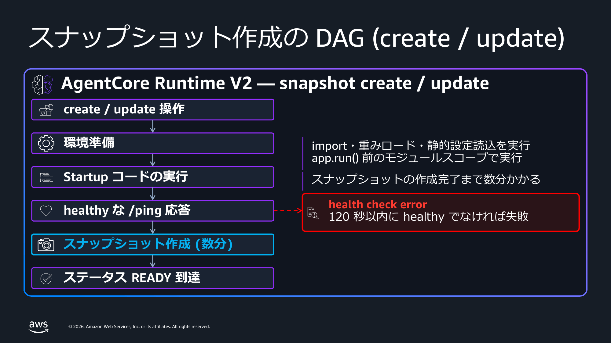
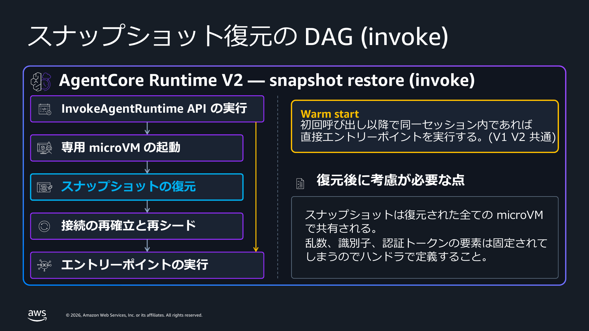

[English](README.md) | Japanese

# Amazon Bedrock AgentCore Runtime V2: platformVersion サンプル

Amazon Bedrock AgentCore Runtime のプラットフォームバージョン V2 を試すためのサンプルコードです。V2 はエージェントをスナップショットから復元して起動するため、同時実行数やイメージサイズに関係なくコールドスタートを速く一貫した状態に保ちます。エージェントランタイムごとに `platformVersion` フィールド (`V1` または `V2`) で選択し、既定値は V1 です。

本リポジトリのスクリプトで、V2 ランタイムの作成、既存の V1 ランタイムから V2 への移行、プラットフォームバージョンの確認、呼び出し、そして V2 が起動時のコードの実行タイミングをどう変えるかの観測ができます。

ブログ記事: https://zenn.dev/aws_japan/articles/agentcore-runtime-v2-platform-version


## ディレクトリ構成

```
.
├── agent-basic/                 最小のエージェント。モジュールスコープとハンドラのマーカーを出力する。
├── agent-globalinit-probe/      プローブ用エージェント。グローバル初期化と遅延初期化を各 10 秒置く。
├── agent-bench/                 計測対象。Strands + Bedrock でストリーミングし、計時マーカーを出力する。
│                                各ディレクトリに main.py と Dockerfile と requirements.txt を置く。
│                                Dockerfile と ZIP 生成は同じ requirements.txt を読む。
├── scripts/
│   ├── common.py                共通の設定とヘルパー。設定はすべて環境変数から読む。
│   ├── check_sdk_version.py     導入済み SDK の platformVersion 対応を確認する。AWS を呼ばない。
│   ├── setup_codezip_artifact.py ARM64 向けの ZIP を作り S3 にアップロードする (Docker 不要)。
│   ├── create_runtime.py        V1 / V2 / 省略でランタイムを作成し READY までを計測する。
│   ├── switch_platform_version.py 既存ランタイムを V1 と V2 の間で切り替える。
│   ├── get_runtime.py           get_agent_runtime で platformVersion を確認する。
│   ├── invoke_runtime.py        新規セッションで呼び出し、セッション再利用と比較する。
│   ├── probe_globalinit.py      プローブを同時呼び出しし、起動時の処理の所在を観測する。
│   └── cleanup_runtimes.py      名前プレフィックスに一致するランタイムのみを削除する。
├── benchmark/
│   ├── apply_config.py          artifact / 環境変数 / platformVersion を 1 回の update で適用し計時する。
│   ├── tps_bench_open.py        開ループの負荷生成。実際に達成した TPS を出力する。
│   ├── build_breakdown.py       クライアントの記録と CloudWatch Logs の [ENTRYPOINT_REACHED] を突き合わせる。
│   ├── plot_preentry.py         pre-entrypoint の分布図を生成する。
│   └── requirements.txt         matplotlib / numpy / scipy
├── images/                      本 README で使用する図
├── requirements.txt             boto3>=1.43.95
├── build/                       ZIP 生成の作業ディレクトリ (.gitignore 対象)
└── results/                     各スクリプトの実行結果 JSON の出力先 (.gitignore 対象)
```

## 前提条件

- Python 3.10 以降が必要です。
- `boto3>=1.43.95` が必要です。`platformVersion` フィールドを含む最初の公開版です。これ未満のバージョンでは、リクエストが送信される前に `ParamValidationError` で拒否されます。
- AgentCore Runtime の実行ロールが必要です。
- V2 が利用できるリージョンで実行します。`us-east-1`、`us-east-2`、`us-west-2`、`eu-west-1`、`ap-northeast-1` の 5 つです。
- コンテナで試す場合は、`docker buildx` が使える Docker と ECR リポジトリが必要です。AgentCore Runtime の microVM は ARM64 Linux です。
- 直接コードデプロイで試す場合は、既存の S3 バケットが必要です。

> 注意: AWS CloudFormation と AWS CDK は現時点で `platformVersion` の設定に対応していません。AWS SDK、CLI、またはコンソールを使用してください。

## セットアップ

```bash
git clone https://github.com/SeongHaedu/amazon-bedrock-agentcore-runtime-v2-samples.git
cd amazon-bedrock-agentcore-runtime-v2-samples

python3 -m venv .venv
source .venv/bin/activate
pip install -r requirements.txt
```

以下のコマンドはすべてリポジトリのルートから実行します。

## 環境変数

`AWS_REGION` は明示的に設定してください。設定しない場合は `us-west-2` が使われます。ランタイムの作成先と `cleanup_runtimes.py` が見るリージョンの両方が変わるためです。

```bash
export AWS_REGION=ap-northeast-1
export AGENTCORE_ROLE_ARN=arn:aws:iam::<account-id>:role/<execution-role>

# コンテナで試す場合
export AGENTCORE_CONTAINER_URI=<account-id>.dkr.ecr.$AWS_REGION.amazonaws.com/<repository>:v2sample

# 直接コードデプロイで試す場合
export AGENTCORE_S3_BUCKET=<bucket-name>
export AGENTCORE_S3_PREFIX=agentcore/codezip/agent.zip   # 省略可。これが既定値である。

# 任意
export AWS_PROFILE=<profile>
export AGENTCORE_NAME_PREFIX=v2sample_                   # cleanup_runtimes.py はこのプレフィックスのみを削除する (4 文字以上)
export AGENTCORE_CODE_RUNTIME=PYTHON_3_11                # 直接コードデプロイのランタイム
export AGENTCORE_ENTRY_POINT=main.py                     # 複数要素を渡す場合はカンマ区切り
export AGENTCORE_WAIT_TIMEOUT_SEC=1800                   # 終端状態になるまでポーリングする上限
export BEDROCK_MODEL_ID=jp.anthropic.claude-sonnet-4-6   # 同名でエージェントに渡す。agent-bench が読む。
export AGENTCORE_ENV_EXTRA=KEY=VALUE,KEY2=VALUE2         # エージェントに渡すその他の環境変数
```

`entryPoint` は配列です。複数の要素が必要な場合はカンマ区切りで渡します。例えば `AGENTCORE_ENTRY_POINT="opentelemetry-instrument,main.py"` のように指定します。

ランタイムには常に `PYTHONUNBUFFERED=1` が設定されます。`BEDROCK_MODEL_ID` と `AGENTCORE_ENV_EXTRA` はその上に重ねられます。作成時は `scripts/create_runtime.py` が、既存ランタイムへの適用は `benchmark/apply_config.py` が反映します。カンマを含む値は `AGENTCORE_ENV_EXTRA` では渡せません。

`agent-globalinit-probe` はさらに 2 つの環境変数を読みます。Dockerfile で両方を 10 秒に設定しています。

```bash
export GLOBAL_INIT_SECS=10   # モジュールスコープでのスリープ。V2 ではスナップショットに取り込まれる。
export LAZY_INIT_SECS=10     # 各セッションの初回リクエストでのスリープ
```

`GLOBAL_INIT_SECS` は 120 より十分に小さい値に保ってください。コンテナは起動から 120 秒以内に healthy を報告する必要があり、このスリープはサーバが listen を開始する前に走ります。大きな値を設定すると、作成または更新がヘルスチェックのエラーで失敗します。

## 手順 1: SDK を確認する

```bash
python scripts/check_sdk_version.py
```

AWS を一切呼びません。導入済みの botocore のサービスモデルを読み、`CreateAgentRuntime` と `UpdateAgentRuntime` のリクエスト側、および `GetAgentRuntime` のレスポンス側に `platformVersion` が存在するかを報告します。`GetAgentRuntime` のリクエスト側に存在しないのは仕様どおりです。`platformVersion` はレスポンス専用のフィールドです。

## 手順 2: アーティファクトを用意する

### 方法 A: コンテナ

```bash
aws ecr get-login-password --region $AWS_REGION \
  | docker login --username AWS --password-stdin \
    $(echo $AGENTCORE_CONTAINER_URI | cut -d/ -f1)

docker buildx build --platform linux/arm64 \
  -t $AGENTCORE_CONTAINER_URI \
  --push agent-basic/
```

### 方法 B: 直接コードデプロイ (Docker 不要)

```bash
python scripts/setup_codezip_artifact.py agent-basic
```

依存関係を `manylinux2014_aarch64` 向けにベンダリングし、`main.py` とともに ZIP にまとめて `s3://$AGENTCORE_S3_BUCKET/$AGENTCORE_S3_PREFIX` にアップロードします。

アップロード先はこの 1 つの prefix です。別のエージェントで再実行するとアーカイブが上書きされ、この prefix を指す全ランタイムが新しいエージェントを配信します。複数のエージェントを共存させる場合は、エージェントごとに `AGENTCORE_S3_PREFIX` を変えてください。手順 8 では `agent-bench` から ZIP を作ります。

## 手順 3: V2 ランタイムを作成する



```bash
python scripts/create_runtime.py basic_v2 container V2
```

ZIP を作った場合は `container` を `codezip` に置き換えます。第 3 引数がプラットフォームバージョンで、`V2`、`V1`、`omit` のいずれかです。

V2 の作成は環境の準備とスナップショットの取得を行うため、秒ではなく分単位の時間がかかります。スクリプトは `get_agent_runtime` をポーリングし、`READY` または `FAILED` で終わる状態になるまで待ち、各ステータス遷移を経過時間とともに表示します。

差を自分で確認する場合は、同じアーティファクトから V1 のランタイムも作成します。

```bash
python scripts/create_runtime.py basic_v1 container omit
```

## 手順 4: プラットフォームバージョンを確認する

```bash
python scripts/get_runtime.py
```

`create_agent_runtime` と `update_agent_runtime` のレスポンスには `platformVersion` が含まれません。`get_agent_runtime` には含まれます。`list_agent_runtimes` にも含まれないため、このスクリプトはランタイムごとに `get_agent_runtime` を呼びます。

ご自身のコードで判定する場合は `resp.get("platformVersion", "V1")` の形で書いてください。V1 が既定値です。

## 手順 5: V1 から V2 へ移行する

```bash
python scripts/switch_platform_version.py <agentRuntimeId> V2
```

`update_agent_runtime` は `roleArn` と `agentRuntimeArtifact` が必須であるため、スクリプトは `get_agent_runtime` で現行値を読み、そのまま引き継ぎます。`environmentVariables` も明示的に引き継ぎます。省略した場合に既存の環境変数がクリアされるかどうかがドキュメントに明記されていないためです。

直接確認する価値のある挙動が 2 つあります。

- `V2` から `V1` への切り戻しは数秒で完了します。スナップショットの準備が不要なためです。
- 既に V2 のランタイムに対して `platformVersion` を省略した更新を行うと、V2 が維持されたうえでスナップショットの準備も実行されます。したがってアーティファクトの差し替えのような通常の更新も、V2 では分単位の時間がかかります。

```bash
python scripts/switch_platform_version.py <agentRuntimeId> V1     # 数秒
python scripts/switch_platform_version.py <agentRuntimeId> omit   # 数分。V2 のまま維持される。
```

update を呼ぶ前に、ランタイムが終端状態 (`READY` または `*_FAILED`) である必要があります。`CREATING` / `UPDATING` / `DELETING` の間に呼ぶと `ConflictException` が返ります。

## 手順 6: 呼び出す



```bash
python scripts/invoke_runtime.py <agentRuntimeId|agentRuntimeArn> 3 2
```

引数はセッション数とセッションあたりの呼び出し回数です。各セッションは新しい `runtimeSessionId` を使うため、初回の呼び出しは必ず起動の経路を通ります。同一セッションの 2 回目は既存の実行環境に着地するため、起動を含まないリクエストの下限が得られます。

`agent-basic` はモジュールスコープで構築した `snapshot_identity` を返します。スクリプトが最後に表示する `distinct identity uuid` の行に注目してください。

- V2 では値がまとまります。コンテナのランタイムに 3 セッションを投げた実測では 1 でした。すべてのインスタンスが同一のスナップショットから復元されています。準備済みのスナップショット 1 つで足りない規模のバーストでは 1 を超えることがあり、手順 7 の 20 並列では 2 になりました。
- V1 では、新しく起動した実行環境の数と一致します。それぞれが自分でモジュールスコープを実行しています。

## 手順 7: 起動時の処理がどこで走るかを確認する

ここが V2 でエージェントコードの書き方が変わる部分です。`agent-globalinit-probe` はモジュールスコープで 10 秒、各セッションの初回リクエストでさらに 10 秒スリープします。

```bash
docker buildx build --platform linux/arm64 \
  -t <account-id>.dkr.ecr.$AWS_REGION.amazonaws.com/<repository>:probe \
  --push agent-globalinit-probe/

AGENTCORE_CONTAINER_URI=<account-id>.dkr.ecr.$AWS_REGION.amazonaws.com/<repository>:probe \
  python scripts/create_runtime.py probe_v2 container V2

python scripts/probe_globalinit.py <agentRuntimeId|agentRuntimeArn> 20
```

末尾の `20` は同時に発行するセッション数です。既定値も 20 です。V1 の pre-warmed instance が枯渇する数を一度に投げてください。数が足りないと、V1 側もグローバル初期化をプールの中で済ませてしまい差が見えません。

V2 では、グローバル初期化の 10 秒はどの呼び出しにも現れません。スナップショットの準備時に 1 回だけ消費されています。遅延初期化の 10 秒は、すべてのセッションの初回呼び出しに現れます。スナップショットがこれを運べないためです。

同じイメージから作成した V1 のランタイムに対して同じことを行い、pre-warmed instance を枯渇させるだけの同時セッションを投げてください。その場合はグローバル初期化がリクエストの経路に現れます。V1 のコンテナデプロイがエンドポイント単位で pre-warmed instance を保持することは [Minimizing startup latency with Amazon Bedrock AgentCore Runtime](https://repost.aws/articles/ARCJIn3t7aRC2FxiRTV1SuCA) に記載があります。

`ap-northeast-1` で 20 セッションを同時に投げた実測値は以下のとおりです。

| | レイテンシー | distinct `baked` uuid |
|---|---|---|
| V2 | 13.6 - 14.2 秒の 1 群 | 2 / 20 |
| V1 | 12.3 秒 x 10 件、27.6 秒 x 10 件 | 20 / 20 |

V2 はすべての呼び出しが遅延初期化の 10 秒だけを負担し、グローバル初期化は負担していません。V1 は 2 群に分かれます。pre-warmed instance に着地した 10 件は遅延初期化のみ、着地しなかった 10 件は両方を負担しています。V2 の distinct が 1 ではなく 2 だったため、「ランタイムのバージョンごとにスナップショットは 1 つ」は結果の傾向として読み、保証として扱わないでください。

プローブが返す他の値にも注目してください。`baked.wall_clock` はモジュールスコープが実行された時刻であるため、V2 ではスナップショットが古くなるにつれて `now` との差が広がります。これが、V2 ではタイムスタンプ・認証情報・乱数シード・確立済みの接続をモジュールスコープで保持してはならない具体的な理由です。詳細は [Optimize your agent for Amazon Bedrock AgentCore Runtime V2](https://docs.aws.amazon.com/bedrock-agentcore/latest/devguide/runtime-v2-optimize.html) を参照してください。

## 手順 8: コールドスタートを自分で測る

記事の分布図を再現する手順です。CodeZip / Container × V1 / V2 の 4 系列について、それぞれ 100 件の新規セッションを投入します。実際のランタイムを作成し、呼び出し、CloudWatch Logs を読みます。


V2 の 2 系列はデプロイ方式に関係なく 2 秒付近の 1 つの狭いピークに収まり、Container V1 は 7 - 8 秒まで広がります。系列間で異なるのは `platformVersion` だけで、アーティファクト・リージョン・ロール・環境変数は同一です。

```bash
pip install -r benchmark/requirements.txt
```

### 計測対象をビルドし、デプロイ方式ごとにランタイムを作る

`agent-bench` は Strands 経由で Bedrock を呼び、レスポンスをストリーミングします。`[MODULE_START]`、`[MODULE_END]`、`[ENTRYPOINT_REACHED]`、`[FIRST_TOKEN]` を出力します。この後の内訳分解はこれらのマーカーに依存します。

既定のモデル ID は `us.anthropic.claude-sonnet-4-6` です。`us.` プレフィックスのクロスリージョン推論プロファイルが存在しないリージョンではこの識別子が拒否され、すべての呼び出しが `ValidationException: The provided model identifier is invalid.` で失敗します。ランタイムを作成する前に、リージョン別のプロファイルを設定してください。

```bash
export BEDROCK_MODEL_ID=jp.anthropic.claude-sonnet-4-6   # ap-northeast-1 の場合
```

作成時は `scripts/create_runtime.py` が引き渡します。既存のランタイムに設定する場合は、この変数を設定したうえで `benchmark/apply_config.py` を実行してください。update にまとめて反映されます。

```bash
export BENCH_IMAGE=<account-id>.dkr.ecr.$AWS_REGION.amazonaws.com/<repository>:bench

docker buildx build --platform linux/arm64 -t $BENCH_IMAGE --push agent-bench/
AGENTCORE_CONTAINER_URI=$BENCH_IMAGE python scripts/create_runtime.py bench_container container omit

python scripts/setup_codezip_artifact.py agent-bench
python scripts/create_runtime.py bench_codezip codezip omit
```

どちらも先に V1 で作ります。この後で V2 に切り替えて戻すため、4 系列がすべて同じアーティファクト・リージョン・ロール・環境変数で走ります。

出力に表示されるランタイム ID と ARN を控えて、環境変数に設定します。

```bash
export AGENTCORE_BENCH_CONTAINER_RUNTIME_ID=<container のランタイム ID>
export AGENTCORE_BENCH_CODEZIP_RUNTIME_ID=<codezip のランタイム ID>
ARN_CT=<container のランタイム ARN>
ARN_CZ=<codezip のランタイム ARN>
```

### V2 で測り、V1 に戻して測る

```bash
# V2
python benchmark/apply_config.py $AGENTCORE_BENCH_CODEZIP_RUNTIME_ID   keep V2 none codezip_v2_open
python benchmark/apply_config.py $AGENTCORE_BENCH_CONTAINER_RUNTIME_ID keep V2 none container_v2_open
python benchmark/tps_bench_open.py $ARN_CZ codezip_v2_open   5 20
python benchmark/tps_bench_open.py $ARN_CT container_v2_open 5 20

# V1。切り替えてから 150 秒待つ。pre-warmed instance の補充を待たずに測ると、
# ウォームな容量が無い状態の V1 を測ることになり、コールド側を過大に見積もる。
python benchmark/apply_config.py $AGENTCORE_BENCH_CODEZIP_RUNTIME_ID   keep V1 none codezip_v1_open && sleep 150
python benchmark/tps_bench_open.py $ARN_CZ codezip_v1_open 5 20
python benchmark/apply_config.py $AGENTCORE_BENCH_CONTAINER_RUNTIME_ID keep V1 none container_v1_open && sleep 150
python benchmark/tps_bench_open.py $ARN_CT container_v1_open 5 20
```

実行ごとに `effective TPS` の行を確認してください。目標を大きく下回っている場合、クライアント側の何かが投入を妨げており、V1 の数値が実態より良く出ます。理由は `benchmark/tps_bench_open.py` の冒頭に書いてあります。

V2 への切り替えはスナップショット準備のため数分かかります。V1 への切り戻しは数秒で終わります。

### レイテンシーを分解して図を生成する

```bash
# 最後の計測から 2 分程度あける。Logs Insights がログを取り込むまで待つ必要がある。
python benchmark/build_breakdown.py open
python benchmark/plot_preentry.py open
```

`build_breakdown.py` はクライアントの記録と `[ENTRYPOINT_REACHED]` のタイムスタンプを `session_id` で突き合わせ、`results/breakdown_open.json` を書きます。照合できないリクエストが 1 件でもあれば、黙って捨てずにエラーで停止します。捨てると分布が歪むためです。`plot_preentry.py` は `benchmark/images/coldstart_distribution_preentry_open.png` を出力します。

### 任意: モジュールスコープの初期化を重くする

`GLOBAL_INIT_SECS` を設定すると、モジュールスコープにスリープを挿入できます。V1 ではリクエストの経路に乗り、V2 ではスナップショット準備時に 1 回だけ消費されます。

```bash
python benchmark/apply_config.py $AGENTCORE_BENCH_CONTAINER_RUNTIME_ID keep V2 25 container_v2_gs25
python benchmark/tps_bench_open.py $ARN_CT container_v2_gs25 5 20
```

値は 120 より小さく保ってください。コンテナは起動から 120 秒以内に healthy を報告する必要があり、このスリープはサーバが listen を開始する前に走ります。

## クリーンアップ

```bash
python scripts/cleanup_runtimes.py          # 対象を表示するだけ
python scripts/cleanup_runtimes.py --yes    # 実際に削除する
```

`AGENTCORE_NAME_PREFIX` (既定 `v2sample_`) で始まる名前のランタイムのみを削除します。`--yes` を付けない場合は一覧を表示して終了します。

プレフィックスが 4 文字未満の場合、スクリプトは実行を拒否します。空のプレフィックスはアカウントとリージョン内のすべてのランタイムに一致するため、この検証は AWS を呼ぶ前に行います。

ランタイム自体の削除は V2 でも数秒で終わります。裏側のスナップショットの消失には最大 8 時間かかります。そのスナップショット上で既に動いているセッションが終了まで継続するためであり、8 時間はセッションの最大寿命です。

## 注意事項と現時点の制限

- V2 はエージェントの環境変数の合計サイズを、直接コードデプロイで 1.5 KB、コンテナエージェントで 2.5 KB に制限しています。V1 は 4 KB です。超えると `ValidationException` で失敗します。ドキュメントにはこの上限を V1 と同じ値まで引き上げる予定と記載されています。
- コンテナは起動から 120 秒以内に `/ping` で healthy を報告する必要があります。間に合わない場合、ヘルスチェックのエラーで作成が失敗します。AgentCore SDK を使う場合はこれが自動的に満たされます。`app.run()` までサーバが listen しないため、スナップショットは構造上、完全に初期化されたエージェントを捉えます。
- AgentCore SDK ではなく独自の HTTP サーバを動かす場合は、初期化が完了してから healthy を返してください。
- コンテナで独自の暗号ライブラリを持ち込む場合は、復元後に再シードする snapshot-safe なビルドを使ってください。Amazon Linux 2023 では `openssl-snapsafe-libs` を使います。直接コードデプロイのサービス管理ベースイメージには snapshot-safe なビルドが既に含まれています。

## 参考

- [microVMs — Platform versions](https://docs.aws.amazon.com/bedrock-agentcore/latest/devguide/runtime-how-it-works.html#runtime-platform-versions)
- [Optimize your agent for Amazon Bedrock AgentCore Runtime V2](https://docs.aws.amazon.com/bedrock-agentcore/latest/devguide/runtime-v2-optimize.html)
- [Host agent or tools with Amazon Bedrock AgentCore Runtime](https://docs.aws.amazon.com/bedrock-agentcore/latest/devguide/agents-tools-runtime.html)
- [The new AgentCore runtime: Elastic, optimized, and consistently fast starts](https://aws.amazon.com/jp/blogs/machine-learning/the-new-agentcore-runtime-elastic-optimized-and-consistently-fast-starts/)
- [Minimizing startup latency with Amazon Bedrock AgentCore Runtime](https://repost.aws/articles/ARCJIn3t7aRC2FxiRTV1SuCA) — V1 のコンテナデプロイがエンドポイント単位で保持する pre-warmed instance について
- [Deploy an agent with direct code deployment (Python)](https://docs.aws.amazon.com/bedrock-agentcore/latest/devguide/runtime-get-started-code-deploy-python.html) — ZIP アーティファクトのパッケージング規則
- [create_agent_runtime](https://docs.aws.amazon.com/boto3/latest/reference/services/bedrock-agentcore-control/client/create_agent_runtime.html) / [update_agent_runtime](https://docs.aws.amazon.com/boto3/latest/reference/services/bedrock-agentcore-control/client/update_agent_runtime.html) / [get_agent_runtime](https://docs.aws.amazon.com/boto3/latest/reference/services/bedrock-agentcore-control/client/get_agent_runtime.html)
