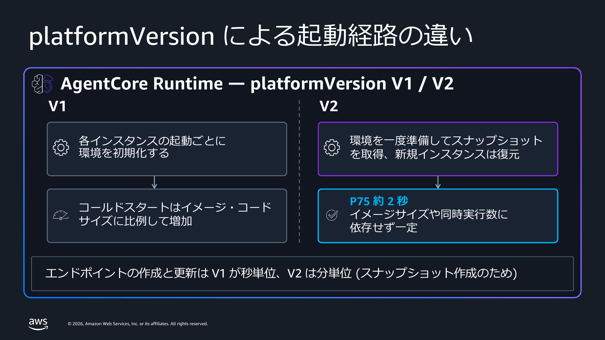
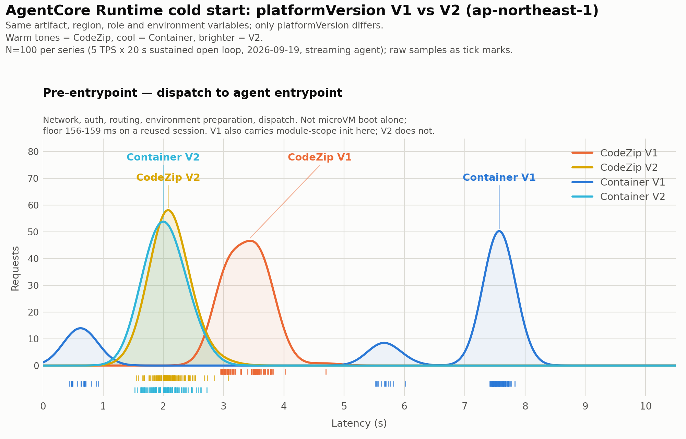

[English](README.md) | Japanese

# Amazon Bedrock AgentCore Runtime V2: platformVersion サンプル

> [!NOTE]
> 本リポジトリは AWS 公式が提供するものではなく、あくまで個人の環境での検証結果に基づいたサンプルです。発言は組織を代表しません。

Amazon Bedrock AgentCore Runtime (以下 AgentCore Runtime) のプラットフォームバージョン V2 を試すためのサンプルコードです。V2 は環境をスナップショットから復元して起動するため、イメージサイズや同時実行数に関係なくコールドスタートが一定に収まります。有効化はエージェントランタイムごとに `platformVersion` を `V2` にするのみで、既定値は `V1` です。

本リポジトリのスクリプトで、V2 ランタイムの作成、既存の V1 ランタイムから V2 への移行、プラットフォームバージョンの確認、呼び出し、そしてコールドスタートの計測ができます。

解説記事: https://zenn.dev/aws_japan/articles/agentcore-runtime-v2-platform-version



デプロイ方式は次のように略記します。

- CodeZip: 直接コードデプロイです。ZIP を S3 に置き、AgentCore が管理する Python 環境で動かします。
- Container: コンテナデプロイです。ARM64 のイメージを ECR に置きます。

`platformVersion` の指定方法は両方式で同じで、アーティファクトの形だけが異なります。

## ディレクトリ構成

```
.
├── agent-basic/                 最小のエージェント。モジュールスコープとハンドラのマーカーを出力
├── agent-bench/                 計測対象。Strands + Bedrock でストリーミングし計時マーカーを出力
│                                各ディレクトリに main.py と Dockerfile と requirements.txt を置く
│                                Dockerfile と ZIP 生成は同じ requirements.txt を読む
├── scripts/
│   ├── common.py                共通の設定とヘルパー。設定はすべて環境変数から読む
│   ├── check_sdk_version.py     導入済み SDK の platformVersion 対応を確認 (AWS を呼ばない)
│   ├── setup_prerequisites.py   実行ロール・ECR リポジトリ・S3 バケットを作成
│   ├── setup_codezip_artifact.py ARM64 向けの ZIP を作り S3 にアップロード (Docker 不要)
│   ├── create_runtime.py        V1 / V2 / 省略でランタイムを作成し READY までを計測
│   ├── switch_platform_version.py 既存ランタイムを V1 と V2 の間で切り替え
│   ├── get_runtime.py           get_agent_runtime で platformVersion を確認
│   ├── invoke_runtime.py        新規セッションで呼び出し、セッション再利用と比較
│   └── cleanup.py               プレフィックスに一致するランタイムと前提リソースを削除
├── benchmark/
│   ├── apply_config.py          artifact / 環境変数 / platformVersion を 1 回の update で適用し計時
│   ├── tps_bench_open.py        開ループの負荷生成。実際に達成した TPS を出力
│   ├── build_breakdown.py       クライアントの記録と CloudWatch Logs の [ENTRYPOINT_REACHED] を突合
│   ├── plot_preentry.py         pre-entrypoint の分布図を生成
│   └── requirements.txt         matplotlib / numpy / scipy
├── images/
│   ├── ja/                      日本語版の図
│   ├── en/                      英語版の図
│   └── commons/                 言語に依存しない図
├── requirements.txt             boto3>=1.43.95
├── build/                       ZIP 生成の作業ディレクトリ (.gitignore 対象)
└── results/                     各スクリプトの実行結果 JSON の出力先 (.gitignore 対象)
```

## 前提条件

- Python 3.10 以降が必要です。
- `boto3>=1.43.95` が必要です。`platformVersion` フィールドを含む最初の公開版であり、これ未満のバージョンではリクエストが送信される前に `ParamValidationError` で拒否されます。
- AgentCore Runtime の実行ロール、ECR リポジトリ (Container で試す場合)、S3 バケット (CodeZip で試す場合) が必要です。いずれも `scripts/setup_prerequisites.py` で作成できます。
- V2 が利用できるリージョンで実行します。対応リージョンの最新の一覧は [microVMs — Supported Regions](https://docs.aws.amazon.com/bedrock-agentcore/latest/devguide/runtime-how-it-works.html#runtime-platform-versions-regions) をご確認ください。
- Container で試す場合は `docker buildx` が使える Docker が必要です。AgentCore Runtime の microVM は ARM64 Linux です。

> [!NOTE]
> AWS CloudFormation と AWS CDK は現時点で `platformVersion` の設定に対応していません。AWS SDK、AWS CLI、またはマネジメントコンソールをご利用ください。

## セットアップ

```bash
git clone https://github.com/SeongHaedu/amazon-bedrock-agentcore-runtime-v2-samples.git
cd amazon-bedrock-agentcore-runtime-v2-samples

python3 -m venv .venv
source .venv/bin/activate
pip install -r requirements.txt
```

以下のコマンドはすべてリポジトリのルートから実行します。

## 手順 0: 前提リソースの作成

```bash
python scripts/setup_prerequisites.py
```

`AWS_REGION` (既定 `us-west-2`) に実行ロール、ECR リポジトリ、S3 バケットを作成し、以降の手順で必要な 4 つの export を出力します。出力をそのまま貼れば設定は完了です。

```bash
export AWS_REGION=<region>
export AGENTCORE_ROLE_ARN=arn:aws:iam::<account-id>:role/AgentCoreV2SamplesExecutionRole
export AGENTCORE_CONTAINER_URI=<account-id>.dkr.ecr.<region>.amazonaws.com/agentcore-v2-samples:v2sample
export AGENTCORE_S3_BUCKET=agentcore-v2-samples-<account-id>-<region>
```

別のリージョンに作る場合は、実行前に `AWS_REGION` を設定してください。V2 が利用できるリージョンは [microVMs — Supported Regions](https://docs.aws.amazon.com/bedrock-agentcore/latest/devguide/runtime-how-it-works.html#runtime-platform-versions-regions) をご確認ください。

既にあるリソースはそのまま使います。作成したリソースには `ManagedBy=agentcore-runtime-v2-samples` タグが付き、`scripts/cleanup.py` の削除対象になります。このタグが無いリソースは削除されません。

実行ロールの権限は [IAM Permissions for AgentCore Runtime](https://docs.aws.amazon.com/bedrock-agentcore/latest/devguide/runtime-permissions.html) に従います。ZIP を置く S3 バケットの読み取り権限は含めません。アーティファクトの取得はサービス側が行います。

### Optional: 環境変数

以下はすべて既定値があります。変えたいときだけ設定してください。

```bash
export AWS_PROFILE=<profile>
export AGENTCORE_S3_PREFIX=agentcore/codezip/agent.zip   # ZIP を置く S3 キー
export AGENTCORE_NAME_PREFIX=v2sample_                   # cleanup.py はこのプレフィックスのみを削除 (4 文字以上)
export AGENTCORE_CODE_RUNTIME=PYTHON_3_11                # CodeZip のランタイム
export AGENTCORE_ENTRY_POINT=main.py                     # 複数要素を渡す場合はカンマ区切り
export AGENTCORE_WAIT_TIMEOUT_SEC=1800                   # 終端状態になるまでポーリングする上限
export BEDROCK_MODEL_ID=jp.anthropic.claude-sonnet-4-6   # 同名でエージェントに渡す。agent-bench が読む。
export AGENTCORE_ENV_EXTRA=KEY=VALUE,KEY2=VALUE2         # エージェントに渡すその他の環境変数
export AGENTCORE_SETUP_ROLE_NAME=<name>                  # setup_prerequisites.py が作るロール名
export AGENTCORE_SETUP_ECR_REPOSITORY=<name>             # 同スクリプトが作る ECR リポジトリ名
export AGENTCORE_SETUP_S3_BUCKET=<name>                  # 同スクリプトが作る S3 バケット名
```

`entryPoint` は配列です。複数の要素が必要な場合は `AGENTCORE_ENTRY_POINT="opentelemetry-instrument,main.py"` のようにカンマ区切りで渡します。

ランタイムには常に `PYTHONUNBUFFERED=1` が設定され、`BEDROCK_MODEL_ID` と `AGENTCORE_ENV_EXTRA` はその上に重ねられます。作成時は `scripts/create_runtime.py` が、既存ランタイムへの適用は `benchmark/apply_config.py` が反映します。カンマを含む値は `AGENTCORE_ENV_EXTRA` では渡せません。

## 手順 1: SDK を確認する

```bash
python scripts/check_sdk_version.py
```

AWS を一切呼びません。導入済みの botocore のサービスモデルを読み、`CreateAgentRuntime` と `UpdateAgentRuntime` のリクエスト側、および `GetAgentRuntime` のレスポンス側に `platformVersion` が存在するかを報告します。`platformVersion` はレスポンス専用のフィールドであるため、`GetAgentRuntime` のリクエスト側に存在しないのは仕様どおりです。

## 手順 2: アーティファクトを用意する

### 方法 A: Container

```bash
aws ecr get-login-password --region $AWS_REGION \
  | docker login --username AWS --password-stdin \
    $(echo $AGENTCORE_CONTAINER_URI | cut -d/ -f1)

docker buildx build --platform linux/arm64 \
  -t $AGENTCORE_CONTAINER_URI \
  --push agent-basic/
```

### 方法 B: CodeZip (Docker 不要)

```bash
python scripts/setup_codezip_artifact.py agent-basic
```

依存関係を `manylinux2014_aarch64` 向けにベンダリングし、`main.py` とともに ZIP にまとめて `s3://$AGENTCORE_S3_BUCKET/$AGENTCORE_S3_PREFIX` にアップロードします。

アップロード先はこの 1 つの prefix です。別のエージェントで再実行するとアーカイブが上書きされ、この prefix を指すランタイムはすべて新しいエージェントを配信します。複数のエージェントを共存させる場合は、エージェントごとに `AGENTCORE_S3_PREFIX` を変えてください。手順 7 では `agent-bench` から ZIP を作ります。

## 手順 3: V2 ランタイムを作成する

作成または更新のときにスナップショットが作られます。AgentCore Runtime がコンテナを起動し、`/ping` が healthy を返すのを待ってから、動いている環境をスナップショットとして保存します。


```bash
python scripts/create_runtime.py basic_v2 container V2
```

ZIP を作った場合は `container` を `codezip` に置き換えます。第 3 引数がプラットフォームバージョンで、`V2`、`V1`、`omit` のいずれかです。

V2 の作成は環境の準備とスナップショットの取得を伴うため、秒ではなく分単位の時間がかかります。スクリプトは `get_agent_runtime` をポーリングし、`READY` または `FAILED` で終わる状態になるまで待ち、各ステータス遷移を経過時間とともに表示します。

差を自分で確認する場合は、同じアーティファクトから V1 のランタイムも作成します。

```bash
python scripts/create_runtime.py basic_v1 container omit
```

## 手順 4: プラットフォームバージョンを確認する

```bash
python scripts/get_runtime.py
```

`platformVersion` は `get_agent_runtime` のレスポンスにのみ含まれます。`create_agent_runtime`、`update_agent_runtime`、`list_agent_runtimes` のレスポンスには含まれないため、このスクリプトはランタイムごとに `get_agent_runtime` を呼びます。

ご自身のコードで判定する場合は `resp.get("platformVersion", "V1")` の形で書いてください。V1 が既定値です。

## 手順 5: V1 から V2 へ移行する

```bash
python scripts/switch_platform_version.py <agentRuntimeId> V2
```

`update_agent_runtime` は `roleArn` と `agentRuntimeArtifact` が必須であるため、スクリプトは `get_agent_runtime` で現行値を読んで引き継ぎます。`environmentVariables` も明示的に引き継ぎます。省略した場合に既存の環境変数がクリアされるかどうかがドキュメントに明記されていないためです。

直接確認する価値のある挙動が 2 つあります。

- `V2` から `V1` への切り戻しは数秒で完了します。スナップショットの準備が不要なためです。
- 既に V2 のランタイムに対して `platformVersion` を省略した更新を行うと、V2 が維持されたうえでスナップショットの準備も実行されます。したがってアーティファクトの差し替えのような通常の更新も、V2 では分単位の時間がかかります。

```bash
python scripts/switch_platform_version.py <agentRuntimeId> V1     # 数秒
python scripts/switch_platform_version.py <agentRuntimeId> omit   # 数分。V2 のまま維持される。
```

update を呼ぶ前に、ランタイムが終端状態 (`READY` または `*_FAILED`) である必要があります。`CREATING` / `UPDATING` / `DELETING` の間に呼ぶと `ConflictException` が返ります。

## 手順 6: 呼び出す

新しい microVM はスナップショットから復元されます。同一セッションの 2 回目以降はこの経路を通らず、エントリーポイントが直接実行されます。


```bash
python scripts/invoke_runtime.py <agentRuntimeId|agentRuntimeArn> 3 2
```

引数はセッション数とセッションあたりの呼び出し回数です。各セッションは新しい `runtimeSessionId` を使うため、初回の呼び出しは必ず起動の経路を通ります。同一セッションの 2 回目は既存の実行環境に着地するため、起動を含まないリクエストの下限が得られます。

`agent-basic` はモジュールスコープで構築した `snapshot_identity` を返します。スクリプトが最後に表示する `distinct identity uuid` の行にご注目ください。

- V2 では値がまとまります。Container のランタイムに 3 セッションを投げた実測では 1 でした。すべてのインスタンスが同一のスナップショットから復元されています。バーストの規模が大きい場合は 1 を超えることがあるため、常に 1 になるとは考えないでください。
- V1 では、新しく起動した実行環境の数と一致します。それぞれが自分でモジュールスコープを実行しています。

## 手順 7: コールドスタートを自分で測る

記事の分布図を再現する手順です。CodeZip / Container × V1 / V2 の 4 系列について、それぞれ 100 件の新規セッションを投入します。実際のランタイムを作成し、呼び出し、CloudWatch Logs を読みます。



V2 の 2 系列はデプロイ方式に関係なく 2 秒付近の 1 つの狭いピークに収まり、Container V1 は 7 - 8 秒まで広がります。系列間で異なるのは `platformVersion` だけで、アーティファクト・リージョン・ロール・環境変数は同一です。

```bash
pip install -r benchmark/requirements.txt
```

### 計測対象をビルドし、デプロイ方式ごとにランタイムを作る

`agent-bench` は Strands 経由で Bedrock を呼び、レスポンスをストリーミングします。`[MODULE_START]`、`[MODULE_END]`、`[ENTRYPOINT_REACHED]`、`[FIRST_TOKEN]` を出力し、この後の内訳分解はこれらのマーカーに依存します。

既定のモデル ID は `us.anthropic.claude-sonnet-4-6` です。`us.` プレフィックスのクロスリージョン推論プロファイルが存在しないリージョンではこの識別子が拒否され、すべての呼び出しが `ValidationException: The provided model identifier is invalid.` で失敗します。ランタイムを作成する前に、リージョン別のプロファイルを設定してください。

```bash
export BEDROCK_MODEL_ID=jp.anthropic.claude-sonnet-4-6   # ap-northeast-1 の場合
```

作成時は `scripts/create_runtime.py` が引き渡します。既存のランタイムに設定する場合は、この変数を設定したうえで `benchmark/apply_config.py` を実行してください。update にまとめて反映されます。

```bash
export BENCH_IMAGE=<account-id>.dkr.ecr.$AWS_REGION.amazonaws.com/<repository>:bench

docker buildx build --platform linux/arm64 -t $BENCH_IMAGE --push agent-bench/
AGENTCORE_CONTAINER_URI=$BENCH_IMAGE python scripts/create_runtime.py bench_container container omit

python scripts/setup_codezip_artifact.py agent-bench
python scripts/create_runtime.py bench_codezip codezip omit
```

どちらも先に V1 で作ります。この後で V2 に切り替えて戻すことで、4 系列がすべて同じアーティファクト・リージョン・ロール・環境変数で走ります。

出力に表示されるランタイム ID と ARN を控えて、環境変数に設定します。

```bash
export AGENTCORE_BENCH_CONTAINER_RUNTIME_ID=<container のランタイム ID>
export AGENTCORE_BENCH_CODEZIP_RUNTIME_ID=<codezip のランタイム ID>
ARN_CT=<container のランタイム ARN>
ARN_CZ=<codezip のランタイム ARN>
```

### V2 で測り、V1 に戻して測る

```bash
# V2
python benchmark/apply_config.py $AGENTCORE_BENCH_CODEZIP_RUNTIME_ID   keep V2 none codezip_v2_open
python benchmark/apply_config.py $AGENTCORE_BENCH_CONTAINER_RUNTIME_ID keep V2 none container_v2_open
python benchmark/tps_bench_open.py $ARN_CZ codezip_v2_open   5 20
python benchmark/tps_bench_open.py $ARN_CT container_v2_open 5 20

# V1。切り替えてから 150 秒待つ。pre-warmed instance の補充を待たずに測ると、
# ウォームな容量が無い状態の V1 を測ることになり、コールド側を過大に見積もる。
python benchmark/apply_config.py $AGENTCORE_BENCH_CODEZIP_RUNTIME_ID   keep V1 none codezip_v1_open && sleep 150
python benchmark/tps_bench_open.py $ARN_CZ codezip_v1_open 5 20
python benchmark/apply_config.py $AGENTCORE_BENCH_CONTAINER_RUNTIME_ID keep V1 none container_v1_open && sleep 150
python benchmark/tps_bench_open.py $ARN_CT container_v1_open 5 20
```

実行ごとに `effective TPS` の行をご確認ください。目標を大きく下回っている場合、クライアント側の何かが投入を妨げており、V1 の数値が実態より良く出ます。理由は `benchmark/tps_bench_open.py` の冒頭に記載しています。

V2 への切り替えはスナップショット準備のため数分、V1 への切り戻しは数秒で終わります。

### レイテンシーを分解して図を生成する

```bash
# 最後の計測から 2 分程度あける。Logs Insights がログを取り込むまで待つ必要がある。
python benchmark/build_breakdown.py open
python benchmark/plot_preentry.py open
```

`build_breakdown.py` はクライアントの記録と `[ENTRYPOINT_REACHED]` のタイムスタンプを `session_id` で突き合わせ、`results/breakdown_open.json` を書きます。照合できないリクエストが 1 件でもあれば、捨てずにエラーで停止します。捨てると分布が歪むためです。`plot_preentry.py` は `benchmark/images/coldstart_distribution_preentry_open.png` を出力します。

### 任意: モジュールスコープの初期化を重くする

`GLOBAL_INIT_SECS` を設定すると、モジュールスコープにスリープを挿入できます。V1 ではリクエストの経路に乗り、V2 ではスナップショット準備時に 1 回だけ消費されます。

```bash
python benchmark/apply_config.py $AGENTCORE_BENCH_CONTAINER_RUNTIME_ID keep V2 25 container_v2_gs25
python benchmark/tps_bench_open.py $ARN_CT container_v2_gs25 5 20
```

値は 120 より小さく保ってください。コンテナは起動から 120 秒以内に healthy を報告する必要があり、このスリープはサーバが listen を開始する前に走ります。

## クリーンアップ

```bash
python scripts/cleanup.py                        # 対象を表示するだけ
python scripts/cleanup.py --yes                  # ランタイムと前提リソースを削除する
python scripts/cleanup.py --yes --keep-resources # ランタイムのみ削除する
```

`AGENTCORE_NAME_PREFIX` (既定 `v2sample_`) で始まる名前のランタイムと、`setup_prerequisites.py` が作成した前提リソースを削除します。`--yes` を付けない場合は一覧を表示して終了します。

削除を絞る仕組みが 2 つあります。ランタイムは名前のプレフィックスで絞り、プレフィックスが 4 文字未満の場合は AWS を呼ぶ前に実行を拒否します。前提リソースは `ManagedBy` タグを確認し、タグが無いものはスキップします。元々アカウントにあったロール・リポジトリ・バケットは削除されません。

ランタイム自体の削除は V2 でも数秒で終わります。裏側のスナップショットの消失には最大 8 時間かかります。そのスナップショット上で既に動いているセッションが終了まで継続するためであり、8 時間はセッションの最大寿命です。

## 注意事項と現時点の制限

- スナップショットは 1 回だけ取得され、復元されたすべての microVM で共有されます。モジュールスコープで生成した値はスナップショット時点に固定されるため、タイムスタンプ・認証情報・乱数シード・確立済みの接続はハンドラ内で生成してください。詳細は [Optimize your agent for Amazon Bedrock AgentCore Runtime V2](https://docs.aws.amazon.com/bedrock-agentcore/latest/devguide/runtime-v2-optimize.html) をご覧ください。
- V2 はエージェントの環境変数の合計サイズを、CodeZip で 1.5 KB、Container で 2.5 KB に制限しています (V1 は 4 KB)。超えると `ValidationException` で失敗します。ドキュメントにはこの上限を V1 と同じ値まで引き上げる予定と記載されています。
- コンテナは起動から 120 秒以内に `/ping` で healthy を報告する必要があります。間に合わない場合、ヘルスチェックのエラーで作成が失敗します。AgentCore SDK を使う場合は `app.run()` までサーバが listen しないため、この条件は自動的に満たされ、スナップショットは完全に初期化されたエージェントを捉えます。
- AgentCore SDK ではなく独自の HTTP サーバを動かす場合は、初期化が完了してから healthy を返してください。
- Container で独自の暗号ライブラリを持ち込む場合は、復元後に再シードする snapshot-safe なビルドをご利用ください。Amazon Linux 2023 では `openssl-snapsafe-libs` を使います。CodeZip のサービス管理ベースイメージには snapshot-safe なビルドが既に含まれています。

## 参考

- [microVMs — Platform versions](https://docs.aws.amazon.com/bedrock-agentcore/latest/devguide/runtime-how-it-works.html#runtime-platform-versions)
- [Optimize your agent for Amazon Bedrock AgentCore Runtime V2](https://docs.aws.amazon.com/bedrock-agentcore/latest/devguide/runtime-v2-optimize.html)
- [Host agent or tools with Amazon Bedrock AgentCore Runtime](https://docs.aws.amazon.com/bedrock-agentcore/latest/devguide/agents-tools-runtime.html)
- [The new AgentCore runtime: Elastic, optimized, and consistently fast starts](https://aws.amazon.com/jp/blogs/machine-learning/the-new-agentcore-runtime-elastic-optimized-and-consistently-fast-starts/)
- [Minimizing startup latency with Amazon Bedrock AgentCore Runtime](https://repost.aws/articles/ARCJIn3t7aRC2FxiRTV1SuCA) — the pre-warmed instances that V1 container deployments keep per endpoint
- [Deploy an agent with direct code deployment (Python)](https://docs.aws.amazon.com/bedrock-agentcore/latest/devguide/runtime-get-started-code-deploy-python.html) — packaging rules for the ZIP artifact
- [create_agent_runtime](https://docs.aws.amazon.com/boto3/latest/reference/services/bedrock-agentcore-control/client/create_agent_runtime.html) / [update_agent_runtime](https://docs.aws.amazon.com/boto3/latest/reference/services/bedrock-agentcore-control/client/update_agent_runtime.html) / [get_agent_runtime](https://docs.aws.amazon.com/boto3/latest/reference/services/bedrock-agentcore-control/client/get_agent_runtime.html)
